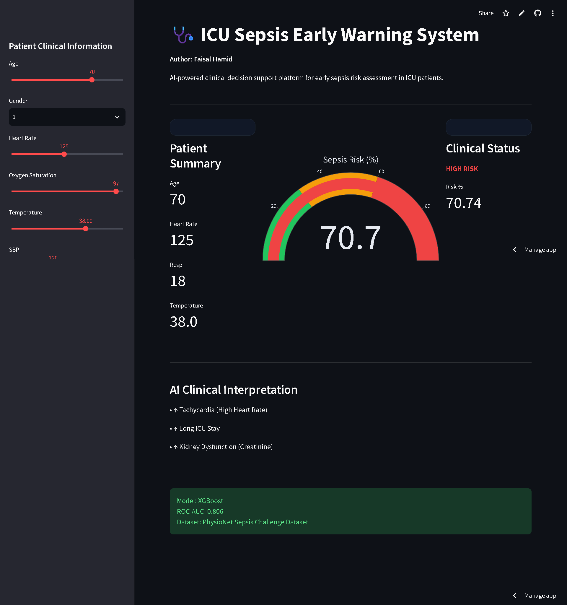

# 🩺 Explainable ICU Sepsis Early Warning System

An end-to-end **Healthcare AI System** for predicting **Sepsis Risk in ICU Patients** using clinical data, machine learning, and explainable AI.

---

## 🚀 Live Demo

| Platform          | Link                                                                      |
| ----------------- | ------------------------------------------------------------------------- |
| Streamlit App     | https://sepsis-early-warning-system-kjmtbe6wxygc3vzyvnrawc.streamlit.app/                                                              |
| GitHub Repository | https://github.com/Faisal1018/Explainable-ICU-Sepsis-Early-Warning-System |

---

## 🎯 Problem Statement

Sepsis is a **life-threatening condition** caused by an extreme response to infection.

⏱️ **Early detection is critical** — delays significantly increase mortality.

---

## 🎯 System Objectives

| Goal                | Description                      |
| ------------------- | -------------------------------- |
| 🔍 Detection        | Identify high-risk ICU patients  |
| 📊 Prediction       | Provide sepsis probability       |
| 🧠 Explainability   | Interpret predictions using SHAP |
| 🏥 Clinical Support | Enable early intervention        |

---

## 📊 Dataset Overview

### 🧾 Source

**PhysioNet 2019 Sepsis Challenge Dataset**

### 📌 Dataset Summary

| Category         | Value                   |
| ---------------- | ----------------------- |
| Total Records    | 546,122                 |
| Total Patients   | 14,057                  |
| Observation Type | Hourly ICU Measurements |
| Target Variable  | SepsisLabel             |
| Positive Cases   | 1,239                   |
| Negative Cases   | 12,818                  |

---

## 🧬 Clinical Feature Groups

| Category        | Features                                         |
| --------------- | ------------------------------------------------ |
| ❤️ Vital Signs  | Heart Rate, Respiratory Rate, O2Sat, Temperature |
| 🩸 Lab Values   | Creatinine, WBC, Glucose                         |
| 🧍 Demographics | Age                                              |
| 🏥 ICU Info     | ICULOS, HospAdmTime                              |

---

## 🔬 Exploratory Data Analysis

### 📈 Key Clinical Insights

| Indicator        | Observation                  |
| ---------------- | ---------------------------- |
| Heart Rate       | Higher in sepsis patients    |
| Respiratory Rate | Significantly elevated       |
| WBC Count        | Increased                    |
| Creatinine       | Elevated (organ dysfunction) |
| ICU Stay         | Longer duration              |

---

## ⚙️ Machine Learning Pipeline

### 🔄 End-to-End Workflow

```id="pipeline1"
┌───────────────────────────────┐
│       Data Understanding       │
└───────────────┬───────────────┘
                ↓
┌───────────────────────────────┐
│        Clinical EDA           │
└───────────────┬───────────────┘
                ↓
┌───────────────────────────────┐
│   Missing Value Analysis      │
└───────────────┬───────────────┘
                ↓
┌───────────────────────────────┐
│      Feature Selection        │
└───────────────┬───────────────┘
                ↓
┌───────────────────────────────┐
│ Patient-Level Data Split      │
└───────────────┬───────────────┘
                ↓
┌───────────────────────────────┐
│ Data Leakage Prevention       │
└───────────────┬───────────────┘
                ↓
┌───────────────────────────────┐
│ Missing Value Imputation      │
└───────────────┬───────────────┘
                ↓
┌───────────────────────────────┐
│ Model Development             │
└───────────────┬───────────────┘
                ↓
┌───────────────────────────────┐
│ Explainable AI (SHAP)         │
└───────────────┬───────────────┘
                ↓
┌───────────────────────────────┐
│ Deployment (Streamlit)        │
└───────────────────────────────┘
```

---

## 🛡️ Data Leakage Prevention

| Approach            | Status     |
| ------------------- | ---------- |
| Random Row Split    | ❌ Not Used |
| Patient-Level Split | ✅ Used     |

✔ Ensures **no patient overlap** between train and test data

---

## 🤖 Model Performance

### 📊 Comparison Table

| Model               | Accuracy | Recall | ROC-AUC   | Notes              |
| ------------------- | -------- | ------ | --------- | ------------------ |
| Logistic Regression | ≈98%     | 0      | -         | Failed (imbalance) |
| Balanced Logistic   | -        | ≈64%   | -         | High false alarms  |
| Random Forest       | -        | -      | 0.796     | Strong baseline    |
| XGBoost             | -        | -      | **0.806** | Best model         |

---

## 🏆 Final Model: XGBoost

### 💡 Why XGBoost?

* Handles class imbalance
* Captures non-linear relationships
* Learns feature interactions
* Works with SHAP
* Best performance

---

## 📈 Threshold Optimization

| Threshold | Precision | Recall | Interpretation     |
| --------- | --------- | ------ | ------------------ |
| 0.50      | 0.14      | 0.36   | Default            |
| 0.30      | 0.11      | 0.50   | Higher sensitivity |

### 🔑 Insight

Lowering threshold improves **early detection (recall)** — critical for healthcare.

---

## 🔍 Explainable AI (SHAP)

### 📊 Top Risk Drivers

| Rank | Feature          |
| ---- | ---------------- |
| 1    | ICULOS           |
| 2    | HospAdmTime      |
| 3    | Respiratory Rate |
| 4    | Heart Rate       |
| 5    | Age              |
| 6    | Temperature      |
| 7    | SBP              |

### 🧠 Clinical Insight

Higher values of:

* Respiratory Rate
* Heart Rate
* Age
* ICU Stay Duration

➡️ Increase **sepsis risk**

---

## 🖥️ Dashboard Features

| Feature              | Description         |
| -------------------- | ------------------- |
| Real-Time Prediction | Instant risk output |
| Risk Gauge           | Visual probability  |
| Risk Categories      | Low / Medium / High |
| Monitoring Interface | ICU-style dashboard |
| AI Explanation       | SHAP insights       |
| Alert System         | High-risk detection |

---

## 📸 Screenshots

### Dashboard


### Confusion Matrix


### Correlation Heatmap


### SHAP Plot

---

## 🛠️ Tech Stack

| Layer            | Tools                       |
| ---------------- | --------------------------- |
| Programming      | Python                      |
| Data Analysis    | Pandas, NumPy               |
| Visualization    | Matplotlib, Seaborn, Plotly |
| Machine Learning | Scikit-Learn, XGBoost       |
| Explainable AI   | SHAP                        |
| Deployment       | Streamlit                   |
| Version Control  | Git, GitHub                 |

---

## 📂 Project Structure

```id="structure2"
Explainable-ICU-Sepsis-Early-Warning-System/
│
├── app/                  # Streamlit app
├── data/                 # Raw & processed data
├── models/               # Trained model
├── notebooks/            # EDA & experiments
├── requirements.txt      # Outputs
└── README.md
```

---

## ⚙️ Run Locally

```bash id="run2"
git clone https://github.com/Faisal1018/Explainable-ICU-Sepsis-Early-Warning-System
cd Explainable-ICU-Sepsis-Early-Warning-System
pip install -r requirements.txt
streamlit run app/streamlit_app.py
```

---

## 👨‍💻 Author

**MD. FAISAL HAMID**

* GitHub: https://github.com/Faisal1018
* LinkedIn: https://www.linkedin.com/in/faisal-hamid-a39ba93b0/

---

## 💻 Languages

| Language         | Usage |
| ---------------- | ----- |
| Jupyter Notebook | 99.4% |
| Python           | 0.6%  |

---
